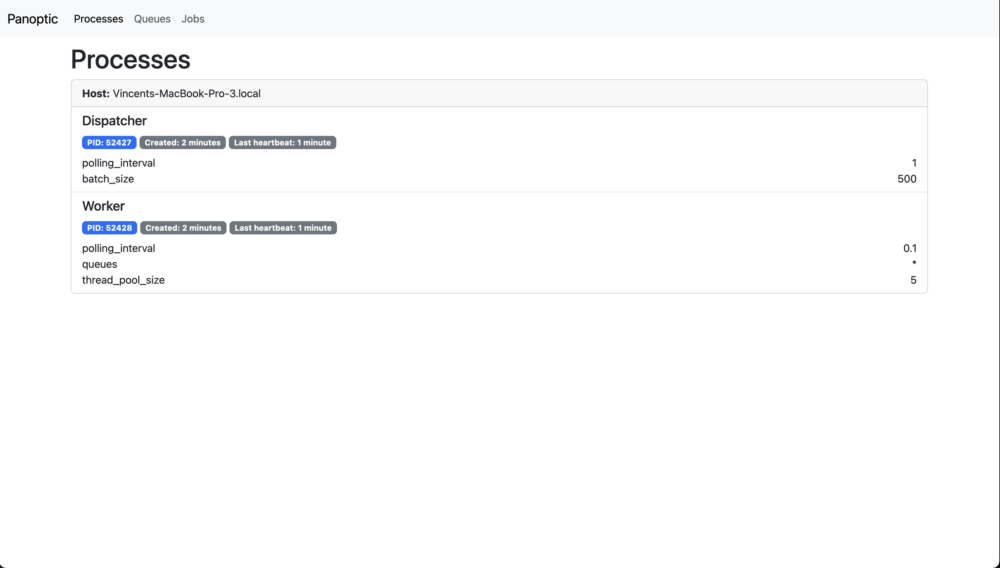

# Panoptic

[](https://badge.fury.io/rb/panoptic)

Panoptic is a web interface for the [SolidQueue](https://github.com/basecamp/solid_queue) queuing backend.



While MissionControl is getting ready for release, this gem offers a visual interface for testing purposes with SolidQueue.

## Installation
Add this line to your application's Gemfile:

```ruby
gem "panoptic"
```

Then mount the engine in your `config/routes.rb` file

```ruby
mount Panoptic::Engine => "/panoptic"
```

## Development

Panoptic requires Node installed to function properly in development. After cloning the repo, run:

```bash
$ bundle install
$ yarn
```

This will install the required Ruby and Javascript dependencies to run the project in development.

The Panoptic UI is accessible after running:

```bash
$ bin/dev
```

This will:
- Start the dummy app server
- Enable asset compilation in development
- Run SolidQueue

After starting the processes, access the UI at:

```
http://localhost:3000/panoptic
```

### Assets

#### CSS
Panoptic uses Bootstrap 5 for its styles. For ease of integration, Bootstrap's Sass is compiled and checked out in version control locally. This removes the dependency on NodeJS for host applications.

New CSS must be added to the `app/assets/stylesheets/panopitc` directory. If your run the UI through the `bin/dev` command above, changes to the files in `assets` will be automatically picked up and compiled in the main stylesheet located at `app/assets/builds/panoptic/application.css`. Otherwise, the `yarn build:css` command needs to be run to reflect changes in CSS.

#### Javascript
Panoptic uses esbuild to compile its Javascript code. Javascript code is located in the `app/assets/javascripts/panoptic` folder.

## Usage

Once the gem is installed and the Engine mounted, visit your engine route to access Panoptic. Three main views are available:
- Processes: display of the running worker and dispatcher process
- Queues
- Jobs: a list of SolidQueue jobs, with filters for scheduled and failed jobs

Current feature set:
- Retry jobs from the failed jobs panel

## License
The gem is available as open source under the terms of the [MIT License](https://opensource.org/licenses/MIT).
